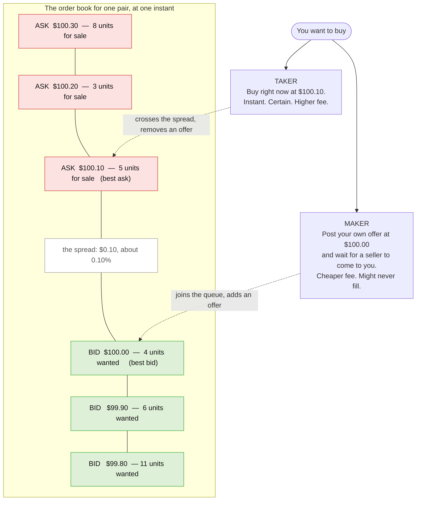
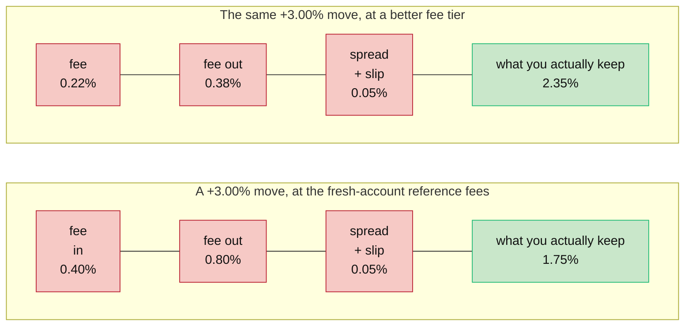
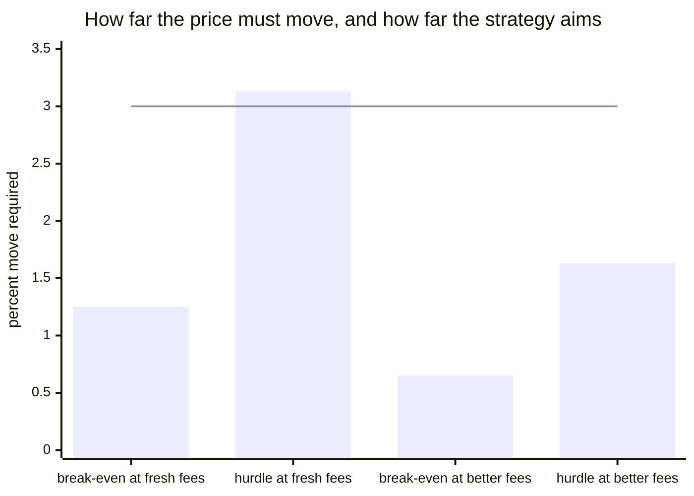
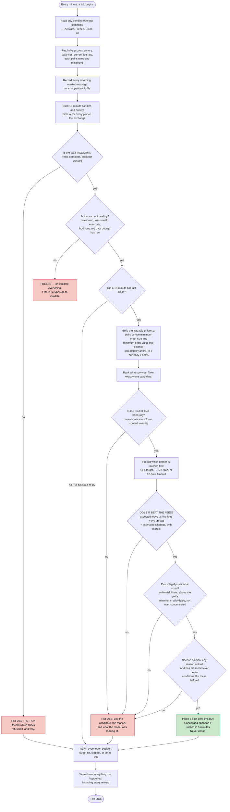

# ACSOE, explained from scratch

*A standalone explanation of what this system is, why it exists, and what had to be solved to
build it. It assumes you know nothing about trading and nothing about this project. Every term is
defined before it is used. Roughly twenty minutes.*

ACSOE stands for **Adaptive Crypto Spot Opportunity Engine**. "Spot" means it buys the actual
thing — real coins, paid for with real cash on hand. No borrowing, no leverage, no betting on
prices falling. You buy, you hold, you sell. That is the whole repertoire.

---

## 1. The question

Almost everything written about automated trading asks one question: **can you predict which way
the price will go?**

That is the wrong question, or at least it is the second question. This system asks the first one:

> **Does a prediction survive the cost of acting on it?**

Here is why the reframing matters. Suppose you had a genuinely good signal. Suppose it told you,
correctly, that a coin was about to rise 0.4% over the next hour. That is a real edge. Most people
do not have one. And it is worthless, because buying and selling that coin costs you more than
0.4%. You would be right, and you would lose money, and you would lose it every single time you
were right.

This happens constantly and quietly. A researcher builds a model, tests it against years of price
history, sees a beautiful upward-sloping equity curve, and never notices that the curve was drawn
by a simulation which assumed the trades were free. Subtract the real cost of trading and the same
curve points downward. The signal was fine. The arithmetic underneath it was fiction.

So this system is built backwards from the usual design. The prediction is one component among
twenty-three, and it is not the important one. The important components are the ones that compute,
from live data, exactly what a trade would cost — and then refuse to place it if the expected gain
does not clear that cost with room to spare.

Most of the machinery exists to say **no**.

That is not a slogan. Of the twenty-three components, nine contain no machine learning at all —
they are plain arithmetic that anyone can read and check. And those nine are precisely the ones
that protect the money. Nothing a model outputs is allowed to overrule any of them. A model can
only ever make the system *less* willing to trade, never more.

There is one more consequence of framing it this way, and it is worth stating at the front. **If
the honest answer turns out to be "no edge survives the fees at this account size", that is a
result, not a failure.** The system is built so it can report that truthfully rather than quietly
finding a way to trade anyway.

---

## 2. How buying actually works

Before any of the cost arithmetic makes sense, you need to know how a purchase on an exchange
actually happens. It is not like buying something in a shop, where there is one price on the tag.

### The order book

For any tradable pair — say Bitcoin against US dollars — the exchange keeps two queues of standing
offers. Together they are called the **order book**.

- **Bids** are people who want to buy, each naming the highest price they will pay.
- **Asks** are people who want to sell, each naming the lowest price they will accept.

The bids sit below, the asks sit above, and there is always a gap between the best of each. There
has to be: if someone were willing to buy at a price someone else were willing to sell at, those
two would have traded already and both offers would be gone.

That gap is called the **spread**.



*The book is two queues of standing offers with a gap between them. To buy immediately you must
reach up into the sellers' queue and pay $100.10 — that is being a taker. To buy cheaply you post
your own offer at $100.00 and wait for a seller to come down to you — that is being a maker. The
$0.10 gap between those two prices is the spread, and crossing it is a cost even before anyone
charges you a fee.*

### Maker and taker

The exchange cares a great deal about which of those two things you did, because it changes whether
you helped or hurt the market's liquidity.

- If you post an offer and wait, you have **added** an offer to the book. Someone else can now
  trade against you. You are a **maker**, and you are charged the lower fee.
- If you reach across and take an existing offer, you have **removed** one. You are a **taker**,
  and you are charged the higher fee.

The taker fee is typically about twice the maker fee. That is a deliberate incentive: the exchange
wants a full book, so it pays you to fill it.

### Why patience is cheaper but uncertain

So the obvious move is: always be a maker. Post your offer, pay the lower fee, save the spread too
since you are buying at $100.00 rather than $100.10.

The catch is that a resting offer is a promise, not a trade. Nobody is obliged to come and take it.
If the price walks away upward, your offer sits there unfilled while the opportunity you were
trying to catch disappears. If the price walks toward you, your offer gets filled — which sometimes
means it got filled precisely because someone with better information was in a hurry to sell to
you, moments before the price dropped further. That last case has a name: **adverse selection**.
Your patience is rewarded exactly when you would rather it were not.

This system always enters as a maker, using an order type called **post-only**: if the order would
accidentally execute immediately as a taker, the exchange cancels it instead. That guarantees the
cheaper fee. And if the order is still sitting unfilled after five minutes, the system cancels it
and abandons the whole idea. It never chases a price upward. A trade that has to be chased was
priced on assumptions that have already stopped being true.

Exits are different. Selling at a profit target can be patient — post an offer, wait. Selling
because a stop-loss was hit cannot be patient. A stop exists to end a loss now, so it goes out as a
taker at whatever the book will give.

Which means every round trip — one buy plus one sell — is assumed to be **maker in, taker out**.
That is the worst realistic case, and it is the case the system prices against.

### Slippage

One last mechanic. Each price level in the book has only so many units behind it. In the diagram
above there are 5 units at $100.10 and 3 more at $100.20. If you try to buy 6 units immediately,
you get 5 at $100.10 and 1 at $100.20 — a worse average price than the one you saw quoted. That
difference is **slippage**, and it grows with the size of your order and shrinks with the depth of
the book.

Fees, spread, and slippage together are what this project calls **friction**: everything that
stands between the price you see and the money you keep, expressed as a percentage of the position,
for a complete round trip.

---

## 3. The hole you start in

Here is the thing that makes short-horizon trading arithmetically impossible for a small account,
and it takes about ninety seconds to see.

**Fees are charged twice.** Once when you buy, once when you sell. There is no round-trip discount.

Take the reference figures this system was designed against: a fresh account pays about **0.40% as
a maker** and **0.80% as a taker**. Add a typical spread and a little slippage — call it 0.05% —
and one complete round trip costs about **1.25%**.

So:

> You buy 10 units at $100.00. That is $1,000 of position.
> You are charged $4.00 going in and about $8.50 going out.
> **You must sell at $101.25 just to get your $1,000 back.**

The price has to move 1.25% in your favour before you have made a single cent. Everything below
that line is you paying the exchange for the privilege of having been right.

Now put a number on a typical short-term move. Over one minute, a liquid crypto pair might move
0.05%. Over fifteen minutes, perhaps 0.2%. You would need to be right about a fifteen-minute move
**six times over** before the fees were paid off. This is why high-frequency strategies are the
exclusive property of firms that pay near-zero fees and sit inside the exchange's own building. At
retail fee levels the arithmetic does not merely make it hard. It makes it impossible, in the way
that a sum can be impossible.

### The bar, drawn



*The same 3% price move, sliced into what the exchange takes and what is left for you. On a fresh
account the fees eat 42% of a winning trade. On a better tier they eat 22%. Nothing about the
prediction changed between those two bars — only the account.*

### The hurdle is not the break-even point

Breaking even is not the bar. Breaking even means you took real risk for nothing. The system
demands that the expected gain beat the friction **with margin to spare** — specifically, that the
net edge after friction must exceed 1.5 times the friction itself.

Rearranged, that means the expected move must be more than **2.5 times friction**.

At the fresh-account reference figures, 2.5 × 1.25% = **3.125%**. And the profit target the system
aims at is +3.00%.

Read those two numbers again. **At a fresh account's fee tier, nothing can clear the hurdle. Ever.**
The required move is larger than the target the strategy is built around.

That is not a bug, and it was not discovered by accident — it was computed deliberately, written
down, and left in place. It is the system telling the truth about its own economics. A small
account on the worst fee tier does not have a viable short-term trading business, and a system that
pretended otherwise would be lying to its owner.



*Bars are the move the price must make. The flat line at 3.00% is the profit target the strategy
aims for. On a fresh account the hurdle bar pokes above the line — the system would have to be
right about something bigger than it is trying to catch, so it trades nothing. On a better tier the
hurdle drops to 1.63% and the target clears it comfortably. Same strategy. Different account.*

### What it takes to be right often enough

Because the profit target (+3%) is larger than the stop-loss (−1.5%), you can be wrong more often
than you are right and still come out ahead — as long as fees do not eat the difference. Fees eat
the difference.

| | Maker fee | Taker fee | Round-trip friction | A win nets | A loss costs | **Win rate needed to break even** |
|---|---|---|---|---|---|---|
| No costs at all *(impossible; the baseline)* | 0.00% | 0.00% | 0.00% | +3.00% | −1.50% | **33%** |
| Fresh account *(reference figures)* | 0.40% | 0.80% | ~1.25% | +1.75% | −2.75% | **61%** |
| A better tier *(reference figures)* | 0.22% | 0.38% | ~0.65% | +2.35% | −2.15% | **48%** |

*The whole table is one story. In a world without costs you need to be right one time in three. On
a fresh account you need to be right nearly two times in three — and predicting the direction of a
crypto price 61% of the time is not a modest ask, it is a world-class result. Move to a better fee
tier and the requirement falls below a coin flip. The strategy did not improve. The tax did.*

**These are reference figures, not the numbers the system uses.** This is important enough to
repeat: there is no fee written anywhere in this codebase. Not in the config file, not in a
constant, not in a comment that something reads. Every fee is fetched from the exchange, live,
before every decision, because your fee tier is assigned automatically from your trading volume and
holdings and it changes underneath you. The numbers above exist so a human can sanity-check the
arithmetic. If the code ever used them, that would be a defect.

The consequence is a property the system gets for free: it is **strictest when your account is
small and loosens automatically as your fee tier improves**. The selectivity is not a setting.
It falls out of the arithmetic.

### Why decide on 15-minute bars but hold for hours

This is the resolution of the whole cost problem, and it is the single most important design
decision in the project.

Price data is usually chopped into **candles** — one summary per time period, giving the opening
price, the highest, the lowest, the closing price, and how much was traded. A 15-minute candle
summarises fifteen minutes.

The system makes decisions on **closed 15-minute candles**. A new trade idea can only be born the
moment a bar closes. That is fine-grained enough to react to a market that moves, and there are
enough of them in a year to learn from.

But it does not *hold* for fifteen minutes. It holds for **two to twelve hours**.

The reason is exactly the arithmetic above. A 3% move does not happen in fifteen minutes on a
typical pair. It happens over hours. So the system checks in often and commits rarely: decide on a
fine grid, then wait on a coarse one.

Every position is opened with three exits already defined, and the model's actual job is to predict
which one gets touched first:

- a **profit target** at +3%,
- a **stop-loss** at −1.5%,
- a **timeout** after 48 bars — twelve hours — at whatever the price happens to be.

This is called **triple-barrier** labelling, and it quietly solves a problem that ruins a lot of
trading research. "Will the price go up?" is not a well-posed question, because it has no
deadline and no magnitude. "Which of these three specific lines does the price touch first?" has
exactly one right answer, known within twelve hours, every time.

Separately, once a position is open, the system wakes up **every minute** to check on it. That
one-minute cycle only ever manages what is already open. It never generates a new idea. Three
different clocks, three different jobs, never confused with each other.

| Horizon | A move you might plausibly capture | Round-trip cost at fresh-account fees | What that means |
|---|---|---|---|
| 1 minute | ~0.05% | 1.25% | Cost is **25×** the move. Arithmetically dead. |
| 15 minutes | ~0.2% | 1.25% | Cost is **6×** the move. Dead. |
| 1 hour | ~0.6% | 1.25% | Cost is **2×** the move. Still dead. |
| 2–12 hours | ~2–3% | 1.25% | Cost is **~40%** of the move. Viable, and only just. |
| Days to weeks | ~5–10% | 1.25% | Cost is minor — but now you are exposed to the whole market's direction, not your skill. |

*Move magnitudes are rough orders of magnitude for a liquid crypto pair, offered to show the shape
of the problem rather than as measurements. The shape is the point: cost is roughly fixed per round
trip, so the only lever you have is to hold long enough for the move to be bigger than the toll.
Too short and the fees win. Too long and you are just betting on the market going up, which
requires no system at all.*

---

## 4. What the system actually does, end to end

The daemon wakes up once a minute, forever. Each wake-up is called a **tick**. On every tick it
runs through the same fixed sequence, in the same order, no exceptions.

There are twenty-three components, called **engines**. They never call each other. Each one reads
what earlier engines wrote into a shared scratchpad, does one job, and writes its own result there.
They are arranged into four ordered lists:

- The **guard chain** runs on every single tick, no matter what mode the system is in, and it
  never stops early. It brings in data and checks the account's health.
- The **opportunity chain** runs only when the system is switched on, nothing has blocked, and a
  15-minute bar has just closed. It stops the instant anything says no.
- The **manage chain** runs on every tick too. It watches open positions and writes everything
  down.
- The **offline chain** never runs in the live loop at all. It is for training and analysis.



*Follow the arrows and count. There is exactly one path to a purchase and six ways to refuse. On
roughly fourteen ticks in fifteen the flow never even reaches the judgement stage, because no bar
closed. Note also what happens when a check refuses: the tick does not stop dead. Data is still
recorded, positions are still managed, and the refusal is written down with its reason. A refusal
is data.*

Four things about this flow deserve to be pulled out.

**Every gate fails closed.** If a check errors, it blocks. If it cannot reach the data it needs, it
blocks. If it gets back something it cannot parse, it blocks. The absence of a "no" is never
treated as a "yes". Concretely: if the exchange fails to answer when asked for the current order
book, the spread for that pair is *missing*, and missing is not zero. A missing spread read as zero
would be the most flattering possible interpretation of a failure, which is exactly why it is
forbidden.

**The components that protect capital contain no models.** The universe filter is arithmetic over
the pair's published minimums and your actual balance. The cost gate is one subtraction and one
comparison. The position sizer is a division. The circuit breaker is four counters against four
thresholds. You can read all of them and check them by hand, which means you do not have to trust
anyone's model to trust that the money is protected.

**Nothing is hardcoded that the exchange can tell us.** Fees, minimum order sizes, minimum order
values, price increments, decimal precision, balances, spreads — every one of them is fetched
live. Not because it is elegant, but because a remembered value that has since changed is a wrong
value that looks exactly like a right one.

**Refusals are recorded as carefully as trades.** Every rejected candidate is written down with its
reason and with an explanation of what the model was looking at when it was rejected. Over time
that becomes a dataset of roads not taken — which is the only way to ever answer "was the system
right to say no?" A refusal that is not written down is treated as a defect equal to a lost trade.

And there is a **circuit breaker** running on every tick, outside all of this. It watches four
things: how far the account is down from its peak, how many losses have come in a row, how many
internal errors have happened in the last hour, and how long the data feed has been untrustworthy.
Breach any of them and it freezes the system. If there is money exposed and the feed has been bad
for fifteen consecutive minutes, it does not freeze — it sells everything and gets flat. The
reasoning is blunt: **unknown exposure is worse than a bad fill.** Holding a position while blind
is the one situation where getting a poor price is the lesser problem.

That liquidation is the only place in the entire system where a rule is overridden. Everything
else makes the system less willing to act. This one thing makes it more willing to act, and it can
only ever *reduce* exposure — it can never open a position.

---

## 5. The recording, and why it matters most

This is the part of the project that is genuinely unusual, and it is easy to walk past.

Kraken publishes free historical price archives going back years. Anyone can download them. They
contain, for every 15-minute period: the opening price, the high, the low, the close, and the
volume traded.

They do **not** contain the bid. Or the ask. Or the spread. Or the depth of the order book.

Look back at section 3 and notice what the cost model needs. Fees come from the exchange's API and
can be fetched any time. But **spread and slippage can only come from the order book** — and the
order book only exists in the present tense. It is a queue of live offers. Ten seconds later it is
a different queue. Nobody stores it, nobody sells it, and there is no price at which you can buy
back a spread from three o'clock last Tuesday morning. If you were not listening, it is gone
permanently.

Which produces a hard, unpleasant fact: **you cannot backtest a cost model against history you did
not record yourself.** And the cost model is the entire point of this project.

So the system has been recording since day one — before there was any engine to consume the data,
and before there was anything to trade with. A standalone script connects to the
exchange's public feed and writes every message it receives to an append-only file — order book
updates, price ticks, individual trades. Nothing edits those files afterwards. Ever. If something
in them is wrong, it is corrected in a separate derived layer with the original preserved, because
a recording you are willing to tidy up is a recording you cannot trust.

Every break in the stream is written into the file as an explicit marker with a stated cause. The
archive does not merely contain the data; it contains an honest account of its own gaps.

### Why 24 continuous hours, and not a working day

The requirement is a clean, unbroken 24-hour recording. Not eight hours, not "a representative
sample". Twenty-four consecutive hours.

The reason is that **the spread is not a constant**. At 3pm on a Tuesday, with European and
American traders both active, the book is deep and the spread is narrow. At 4am the market makers
have thinned out, the book is shallow, and the spread on the same pair can be several times wider.
Slippage follows the same daily rhythm, for the same reason.

Record only the busy hours and you build a cost model that says trading is cheaper than it is. Then
you deploy a system that trades at 4am — because it runs continuously, and 4am is a third of its
life — using a cost estimate gathered at 3pm. Every one of those trades is priced on a fiction, and
they are priced generously in exactly the direction that makes your results look good.

Twenty-four hours forces the full daily cycle into the measurement: the quiet stretches, the
handover between regions, the busy overlaps. It is the difference between an honest friction
estimate and a flattering one.

### Why nobody else solves this

Here is the part that makes this project's contribution what it is.

A professional trading desk does not have this problem. It has a market data subscription, or a
direct exchange feed, or a vendor delivering historical order book snapshots, and it has had all of
that running for years before anyone asked a research question. When a quant at such a desk wants
to know what the spread on a pair was at 4am eighteen months ago, they run a query. The
infrastructure was built once, by a team, and it is simply *there*.

So the problem never gets solved for anyone else — not out of secrecy, but out of irrelevance.
Nobody builds a spread-recording apparatus for an individual, because the people who need spread
data already have it and the people who do not have it are mostly not asking.

Meanwhile the retail world inherits tools built by people who had this problem and did not notice.
Backtesting platforms almost universally simulate a fill at the **mid-price** — the exact midpoint
between the best bid and the best ask — which is a price at which, in the real world, *nobody can
trade*. It is a mathematical average of two offers, not an offer. Assuming you can transact there
silently deletes half the spread from every trade in the backtest, in your favour, on both sides.

And here is the sting: **the smaller your account, the more this matters.** A large desk pays
0.02% and its costs are a rounding error against its returns. A fresh retail account pays 0.40% and
1.20% — sixty times more — and the fees are not one factor among many. They are the whole problem.
The people with the least ability to model their trading costs are the people whose trading costs
dominate everything else about their results.

This system records the data itself, from day one, and computes its costs from what it actually
observed. That is what makes its cost model honest, and it is honest precisely at the scale where
honesty is hardest to come by and matters most.

---

## 6. Who this is for

There is a gap, and it has a very specific shape.

| | Retail trading bots | Open-source backtest frameworks | Hosted backtesting platforms | Professional desks | **This system** |
|---|---|---|---|---|---|
| **Where fees come from** | A number typed into a settings box, often left at the default | A parameter you supply; frequently left at zero | A per-venue estimate, static | Live, from the exchange | **Live, fetched before every decision. No fee exists anywhere in the code.** |
| **Spread** | Ignored entirely | Usually not modelled | **Assumed away — fills simulated at the mid-price** | Measured from the desk's own feed | **Measured from the live book, and recorded so it can be measured historically** |
| **Slippage** | Ignored | An optional fixed percentage | A simple volume-based estimate | Modelled from real depth | **Estimated from the actual depth of the book** |
| **Can it refuse a trade on cost grounds?** | No — it trades the signal | No | No | Yes | **Yes, and this is its central mechanism** |
| **Are refusals recorded?** | No | No | No | Sometimes | **Every one, with its reason and an explanation of what the model saw** |
| **Historical spread data** | None | None | None | Bought or inherited | **Recorded from day one, because it cannot be bought back** |
| **Fee tier adapts selectivity** | No | No | No | Implicitly | **Yes — the hurdle is computed from your live tier, so the system is stricter when you are small** |
| **What it optimises for** | Profit in the backtest | Whatever you ask it to | Backtest return | Risk-adjusted return net of costs | **Return that survives costs, benchmark exposure, and a penalty for how many models were tried** |

*Read the "Spread" row on its own. Three of the five common approaches assume a cost that is real,
unavoidable, and paid on every single trade simply does not exist. That is not a small modelling
simplification; it is the difference between a strategy that works and one that does not.*

So: **retail tools ignore cost entirely. Backtesting platforms silently assume you can trade at a
price nobody can trade at. Professional desks do it properly and publish nothing.** This system
does it properly at an individual's scale.

The other half of the answer is about what counts as a result. When this system reports
performance, it separates two things that are almost always mixed together. If Bitcoin rose 20% and
your portfolio rose 8%, you did not make 8% through skill — you made it by being exposed to a
rising market, and your skill actually cost you 12%. The portion explained by simply being in the
market is called **beta**. What is left over is **alpha**, and only alpha is evidence of anything.
Models are promoted on alpha, after further penalising the score for how many different models were
tried — because if you test twenty strategies and pick the best one, you have found the luckiest,
not the best, and there is well-established arithmetic for how much to discount it by.

The benchmark it has to beat is not zero. It is **buy and hold** — doing nothing at all. That is
the honest comparison, because doing nothing is free, requires no system, and is available to
everyone.

---

## 7. Problems that had to be solved

Every one of these is real. They are worth reading not because the code is interesting but because
each is a way that a system can be confidently, silently wrong — and most of them would never have
announced themselves.

### The kill switch that could never fire

The system has an emergency stop. A human presses a button in the local dashboard, and the daemon
that holds the exchange connection sells everything and gets flat.

The two are separate programs on purpose — the dashboard holds no credentials and cannot place an
order, which means nothing reachable from a browser can move money. They communicate through a
shared database: the dashboard writes a row that says *close everything*, and the daemon reads
pending rows at the top of every tick.

The daemon asked the storage layer for a function to fetch those pending rows. The function did not
exist. It never had. The lookup came back empty, the daemon wrote one line to a debug log and
carried on, and **every emergency stop ever pressed would have been silently ignored.**

Both sides had tests. Both sides passed. That is the interesting part. The dashboard's tests used a
stand-in for the storage layer; the daemon's tests used a different stand-in. Each stand-in
implemented the shape its author *expected* the other side to have. So the two halves of the system
agreed with each other perfectly, and both of them disagreed with reality, and nothing anywhere
compared either of them against the real thing.

Fixing it uncovered two more faults hiding behind the first. The code that marked a command
finished was calling with the wrong arguments and would have crashed — but it had never been
reached, because the broken lookup returned before it. And the recovery logic that is supposed to
re-apply an interrupted emergency stop after a crash had never been written at all. Which is the
worst of the three: a daemon killed halfway through a liquidation would have restarted believing
the job was done, with the positions still open. That is the one failure the emergency stop exists
to prevent.

**The lesson.** A seam between two components, tested only through stand-ins on both sides, is not
tested — the stand-ins are. The check that now covers this refuses every stand-in: real database,
real storage layer, real daemon, from a fresh process.

### Money stored as text that silently accepted numbers

Money must never be stored as a floating-point number. Floating-point arithmetic cannot represent
0.1 exactly, so sums of money drift — invisibly, by tiny amounts, in a direction nobody chose.

That matters here more than it does in most places. The system writes a running record of account
value, one entry per tick. The circuit breaker reads that record to compute how far the account is
down from its peak, and liquidates everything if it crosses a threshold. **A drifting number in an
equity series moves the line at which the system sells everything.** Not by much. But the direction
is random and the consequence is total.

So the rule was: money is stored as exact decimal *text*. The column was declared as a text column,
with an explicit check attached saying "the value in here must be text".

It enforced nothing.

The database engine applies something called type affinity: a column declared as text will
*helpfully convert* a number into a string before storing it. So a drifting float arriving at that
column was quietly converted to the string `"0.3"` — and the check then looked at it, saw text,
and approved. The check was running. The check was passing. The float had already been lost one
step earlier.

The form that actually works is counter-intuitive enough that it needed a comment explaining
itself: declare the column as accepting **anything**, in the database's strict mode, and keep the
explicit type check. Because "anything" is the one declaration that stores the value exactly as
given, the check finally sees a real number and rejects it. The contents are guaranteed to be text
far more strongly by declaring the column "anything" than by declaring it "text".

This has already invited a correction once. Someone saw `equity is ANY` in a test failure and
proposed putting `TEXT` back, which would have quietly reopened the hole. The reasoning now lives
next to the code, because a tidy-looking fix here is a silent regression in the money path.

### A continuity check that measured elapsed time

The recording requirement was a continuous span of at least 24 hours, with every break accounted
for.

The check for it was rigorous about the accounting. Every microsecond between the first line of the
archive and the last had to be claimed by either a recorded segment or an explicit gap, the pieces
had to tile perfectly with no overlap and no hole, and every gap had to carry a stated cause. That
part was genuinely strong — a break that nobody had noticed could not hide, because the pieces
would not fit together.

And it enforced continuity **not at all**. It measured the distance from the first timestamp to the
last one and compared that to 24 hours.

A 24-hour span with nothing missing, and a 24-hour span with eleven hours missing, tile identically,
carry causes identically, and pass identically. The word *continuous* did no work whatsoever.

This was caught by running the check against the real archive early, out of curiosity, before it
mattered. The archive covered a span of 22.16 hours — of which **10.93 hours were recorded and
11.24 hours were missing**, across an overnight stretch when nothing was running, four short
silences, and two recorded disconnections. It was hours away from satisfying the requirement while
being 49% recorded.

The response was to state the recorded fraction as a first-class number in every report, so the
weakness is visible in the artefact itself rather than only to someone who divides one number by
another in their head — and then to throw the contaminated archive away and start a clean run.
Deliberately, a minimum recorded fraction was *not* turned into an automatic threshold on the spot,
because any number chosen in that moment would have had to sit below 49% to let the existing
archive through. That sets the bar at whatever you happened to get rather than at a number anybody
would choose.

### The recorder whose reconnect delay doubled forever

When a network connection drops, the polite thing to do is wait before retrying, and to double the
wait each time it fails again — so a struggling server is not hammered by a client retrying
frantically. Wait one second, then two, then four. When a connection finally succeeds, reset back
to one second, because the outage is over.

The recorder did all of that. The reset was placed after the message-reading loop returned.

The message-reading loop never returns. It is an infinite loop that only exits by throwing an
exception when the connection dies. So the reset line was unreachable in practice, and the delay
doubled on **every** disconnection for the life of the process — even when every single reconnection
had succeeded on its first attempt. Nothing was failing. The delay grew anyway.

A recorder dropping once an hour would, twelve hours in, sit out a full minute after each drop. And
every one of those minutes is order book data that no later work can obtain by any means, at any
price.

The code reads correctly. Reading it will not find this. It was found because a sample file needed
to contain a real gap marker, and the only way to produce a real gap marker is to cause a real
disconnection. Forcing several in a twenty-second window printed this:

```
reconnecting in 0.6s (attempt 1)
reconnecting in 1.3s (attempt 1)
reconnecting in 2.0s (attempt 1)
reconnecting in 4.2s (attempt 1)
```

The delay doubling while the attempt counter stays at 1 is the whole tell: two things that should
have reset together were being reset at different points in the loop. Without a test fixture that
was required to contain evidence of a real failure, there would have been no reason to break the
connection repeatedly, and nobody would ever have seen those four lines.

After the fix, the same forced-disconnection run gives 0.8, 1.1, 0.9, 0.7, 1.4, 1.1, 1.1 — flat, as
it should be.

### A safety mechanism disarmed by a string

The circuit breaker counts how many internal errors have occurred in the last hour, and freezes the
system if there are too many. It counts by asking the database for rows whose status equals
`ERROR`.

The status values came from a small set of named constants. They were declared in a way that looks
completely normal and behaves correctly everywhere except one place: converting one of them to text
produces `"EngineStatus.ERROR"` — the name of the constant — rather than `"ERROR"`, its value.

Somewhere along the path from the engine that reports an error to the database column that stores
it, that conversion happens. So the column fills with plausible-looking strings that never match
what the query asks for. The error count reads zero. Forever.

Nothing crashes. Nothing logs a warning. No test fails. A safety mechanism simply stops working,
and it looks exactly like a safety mechanism that is working and has nothing to report.

The fix was one word in a declaration, changing the constants so their members equal their own
text. The tempting alternative — silencing the code-quality tool that had flagged the declaration
style as outdated — would have left the defect in place to keep a linter quiet.

### The background thread that would have died silently

Market data arrives continuously and the main loop only wakes once a minute, so the connection to
the exchange runs on its own background thread, buffering everything as it arrives.

That thread caught network errors and reconnected, which is the obvious set of things to catch.
Anything *else* escaping — an unexpected message shape, a corrupted payload, running out of memory
— would have ended the thread.

There is no caller to raise the error into. The thread is a background thread; the traceback goes
somewhere nobody looks. The process continues perfectly happily, reporting itself as not connected,
and no data arrives.

**A dead recorder is indistinguishable from a quiet market.** Both look like an absence of
messages. And that is the single failure the entire recording apparatus exists to make impossible,
because you would find out weeks later, when you went looking for data that was never captured.

The thread now catches everything. When something unexpected escapes, it writes the break into the
append-only archive as a gap whose stated cause names the failure, and reconnects. That is not a
swallowed error: the failure ends up in the permanent record, where it outlives the process, rather
than in a log file that rotates away in a fortnight. And if the fault is permanent, the archive
fills with identically-caused gaps, which says so about as plainly as anything could.

### A cleanup that never cleaned up, and a recorder that recorded its own death

A routine development script created a temporary working directory each time it ran, and never
removed it. Each one was about 450 megabytes. Several people ran that script repeatedly for a
couple of weeks.

Over 250 abandoned directories. **114 gigabytes.** The disk went to 100% full — 118 megabytes free
out of 923 gigabytes.

The first symptom was not a disk error. It was a text file being **truncated to zero bytes**
halfway through being written. Someone lost a document and had to restore it from version control
before anyone thought to look at free space.

But the best evidence of what happened came from somewhere else entirely. The market recorder,
which had been running throughout, wrote this line into its own archive:

```
09-09 13:06:37 -> 13:06:39   disconnect: OSError: [Errno 28] No space left on device
```

**The recorder recorded its own death**, timestamped to the second, from a source entirely
independent of the process that reported the problem — and it recorded the restarts either side of
it too. The one failure mode the entire recording apparatus exists to make impossible is a break
that goes unrecorded. It caught the break that killed it.

That is the strongest single argument in the project for the design decision described in section
5: requiring that every second of a recording be accounted for, rather than merely counting how
many gaps there were. A gap count can be correct while a break sits entirely unnoticed. Two
segments with a hole between them that nobody compared produce a perfectly plausible count of zero.

### The pattern underneath most of these: an assertion that cannot fail

Look back at the last several stories and you will see the same shape.

A check whose output resembles the claim, while the claim is untrue.

The continuity check printed a rigorous verdict about accounting and said nothing about continuity.
The type constraint on money ran, passed, and enforced nothing. The error counter queried a column
correctly and could never match a row. A test that ran a process twice and confirmed the second run
still passed, when the mechanism it was checking for had already been made impossible by something
else in the file — so it would have passed identically against the very defect it was written to
catch. A check named "an empty registry produces a valid tick" whose body actually asserted "nothing
blocked" — two claims that coincided exactly as long as nothing was registered, and would silently
stop coinciding the moment anything was. And, most uncomfortable of all: a check that constructed
its own copy of the thing it was testing against, written by the same hand that had got that thing
wrong, so it ran successfully against a fiction that agreed with the mistake.

Every one of those printed something that looked like verification. Not one of them was verifying
anything.

**The rule adopted in response: an assertion that cannot fail is not an assertion.** Its corollary:
an assertion is decayed if it would still pass when the thing it names is false.

What is striking is how these were actually found. **Not one was caught by running the tests.**
Running the tests is precisely the activity these defects are invisible to — they are green, and
they are green for the wrong reason. Three things found them, and all three are cheap:

1. **Reading the source of something before building against it**, rather than assuming its shape.
2. **Making a passing check fail on purpose.** Deliberately break the thing it is supposed to
   detect and confirm it goes red. If it stays green, it was decorative. A check nobody has ever
   seen fail is a comment.
3. **Dry-running an artefact before committing to it**, rather than at the moment it has to be
   right.

There is a human version of the same failure, and it happened here too. Someone saw two processes
with identical command lines writing to the same file and concluded the archive had been recorded
twice over. A correction was issued that refined the timeline. Both were wrong: the operating
system lists a parent and a child because that installation's interpreter re-launches itself, and
the timestamps were being read in local time rather than UTC — an hour out, which turned a restart
after a known outage into a second recorder joining a first. Two people held a confident, detailed,
mutually reinforcing belief about corrupted data.

Settling it took thirty seconds: count byte-identical messages either side of the supposed
boundary. Zero. And zero. There was no duplication anywhere in the archive, and the tool that
proved it had been written that same morning by one of the two people who was wrong.

Reasoning forward from an inference is not evidence, however carefully you reason. **Check the
artefact, not the process table.**

---

## 8. What it does not do

Plainly, because a system whose entire premise is honest accounting should be honest about itself.

**It cannot tell you where the price is going.** It does not try. It estimates which of three
pre-declared lines gets touched first, over a horizon of hours, and even that is an estimate with a
probability attached.

**It might conclude there is nothing here.** If no edge survives the fees at this account size,
that is what it will report. The whole design exists so it can say that truthfully rather than
finding a way to keep trading. At a fresh account's fee tier it is already the case that nothing
can clear the cost hurdle at all — that is arithmetic, and it is written down rather than hidden.

**It only buys.** Long positions only, spot only, one exchange only. No short selling, no margin,
no leverage, no futures, no options. It cannot profit from a falling market; it can only stay out
of one.

**The cost model is only as old as the recording.** Order book history cannot be recovered. Any
analysis covering a period before recording began either excludes the spread and depth components
or models them from a stated proxy — and it must say which. A backtest that silently assumes zero
spread is not a weaker result. It is an invalid one.

**Some things cannot be proven without a live connection.** The exact field names in the exchange's
responses and the request-signing scheme are assumptions until confirmed against a real key. They
are deliberately isolated into a handful of small named functions so that correcting them is an
obvious edit rather than an excavation, and a renamed field surfaces as an error naming that field
rather than as a silent default. But no amount of offline testing can turn that into certainty.

**Its candle-building is checked against its own reference calculation.** The archive contains
individual trades, not the exchange's own published summaries, so the 15-minute candles it builds
are verified against a deliberately naive independent re-computation over the same trades. That
catches a bug in the grouping or the arithmetic. It cannot catch a shared misunderstanding of what
a candle is, because both implementations came from the same place. This limitation is recorded
inside the test data itself rather than left for a reader to infer.

**It runs in simulation by default.** Real orders require three independent switches — an
environment variable, a config setting, and a file containing today's date — all set at once. A
missing, malformed, or stale switch means simulation. There is no code path that promotes
simulation to live trading implicitly.

**One machine, one person, one account.** No multi-user support, no billing, no deployment story,
no ambition to manage anyone else's money.

**And it can lose money.** It is research software for a dissertation. Nothing in it is financial
advice.

---

## In one paragraph

Most trading research asks whether price can be predicted. This system asks whether a prediction
survives being acted on. Buying and selling costs about 1.25% per round trip on a small account, so
a 0.4% signal is worthless no matter how correct it is — and the tools most people use to test
these ideas silently assume that cost away by simulating fills at a price nobody can actually
trade at. Fixing that requires the spread and the depth of the order book, which exist only in the
moment and can never be bought back afterwards, so this system has been recording them itself from
the first day. It fetches every fee live, computes the real cost of every candidate trade, refuses
anything that does not beat that cost with margin to spare, and writes down every refusal along
with its reason. Nine of its twenty-three components contain no machine learning at all, and those
nine are the ones that hold the money. If the honest answer turns out to be that nothing survives
the fees, it is built to say so.
