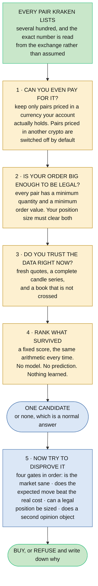
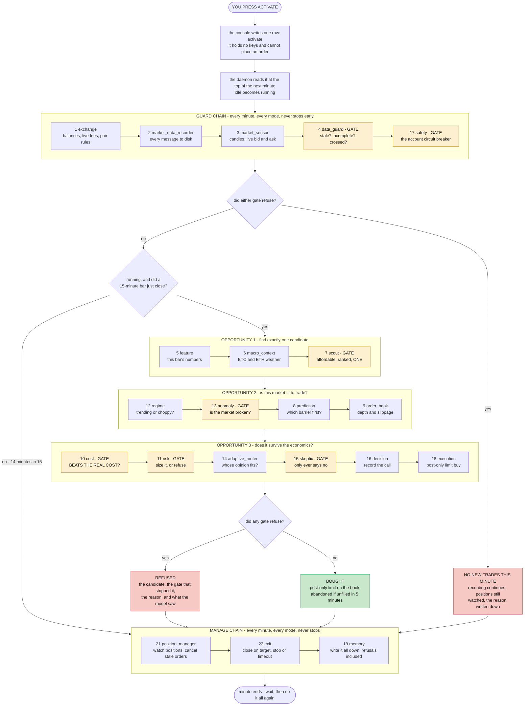
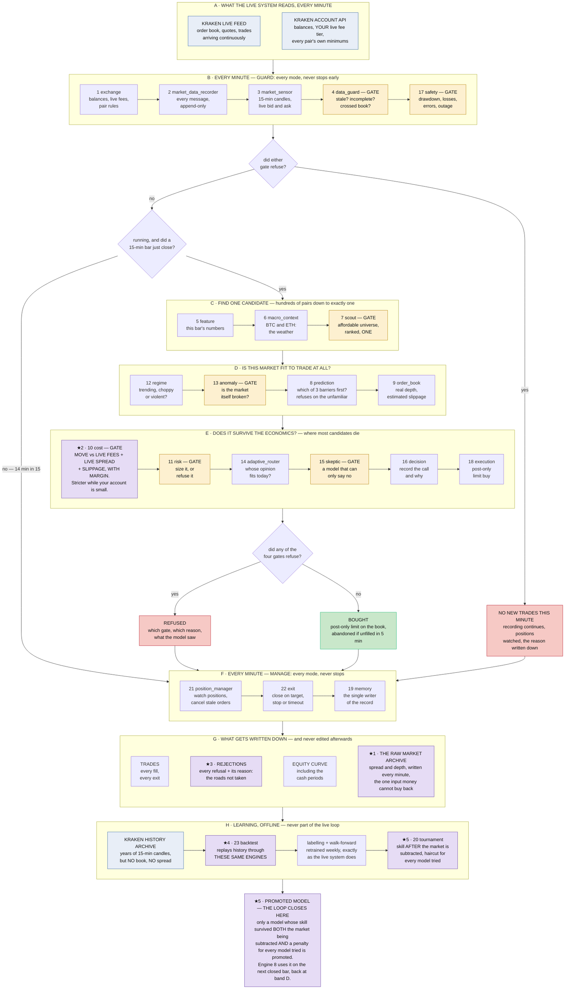

# How ACSOE picks a coin, and every engine that gets it there

*A companion to [SYSTEM-EXPLAINED.md](SYSTEM-EXPLAINED.md). That document explains why the system
exists. This one answers three practical questions — what happens when you press Activate, how one
coin gets chosen out of everything Kraken lists, and what each of the twenty-three engines does —
and then puts the whole thing on one page in section 5. No prior knowledge assumed.*

---

## 1. What happens when you press Activate

The button lives in a small web page that runs on your own machine. Pressing it does exactly one
thing:

> **It writes a single row into a database table that says `activate`.**

That is all. The page holds no exchange keys and has no ability to place an order. It cannot buy
anything even if something went badly wrong with it. This separation is deliberate: the only
program that can touch money is the background program, and the only thing the button can do is
leave it a note.

The background program — the **daemon** — wakes up once every minute, forever. Each wake-up is
called a **tick**. At the top of every tick it reads any notes left for it. Finding your
`activate` note, it switches its mode from `idle` to `running` and marks the note as read.

Three things are worth knowing about that moment.

**Nothing happens immediately.** Activating does not buy anything. It gives the system permission
to start *looking*, and looking only happens when a 15-minute candle closes. So after you press
Activate you may wait up to fifteen minutes before the system even considers a trade, and it will
very likely then decide not to take one.

**It was already collecting data before you pressed anything.** Recording market data, building
candles and watching the health of the account all happen in every mode, including `idle` and
`frozen`. Activate does not switch the system on; it switches on the part that is allowed to
*buy*. This matters because order-book and spread history cannot be recovered later, so the
recorder must never be gated behind a button.

**It never survives a restart.** If the daemon crashes and comes back, it comes back `idle`, not
`running`. Any open position is still watched and still exited normally, but nothing new is
opened until a human presses Activate again. A program that quietly resumed trading after a crash
it did not understand would be the wrong kind of helpful.

There are two other buttons. **Freeze** stops new trades while continuing to record data and
manage whatever is already open. **Close all** is the emergency stop: it cancels every resting
order and sells every open position, and it keeps retrying until both are actually done.

---

## 2. How one coin gets chosen out of the whole exchange

Here is the thing most people expect, and it is not what happens:

> ❌ *"Score every coin on Kraken by how much it is likely to rise, sort the list, and buy the top
> one."*

That is not the design, for two reasons. Running a model over several hundred pairs every fifteen
minutes would be slow and would encourage the system to go hunting until it found something.
And "most likely to rise" is the wrong question anyway — a coin that is likely to rise 0.5% is a
losing trade once fees are paid.

What actually happens is an **elimination funnel**. The system narrows the exchange down to one
plausible candidate using cheap, model-free arithmetic, and then spends all of its remaining
effort trying to *disprove* that one candidate. The expensive thinking happens once, not hundreds
of times.

*The funnel. Steps 1 to 3 are subtraction — they remove pairs you could not legally or safely
trade right now. Step 4 is the only place anything is ranked, and it is ordinary arithmetic that
produces the same answer every time from the same inputs. Step 5 is where the real work happens,
and it happens on exactly one coin.*

### The steps, in plain terms

**Step 1 — can you pay for it?** Every Kraken pair is two things traded against each other. In
`SOL/USD` you are buying SOL and paying in USD. If your account holds only US dollars, then a pair
priced in euros is not tradable no matter how attractive it looks, because you do not hold euros.
Pairs priced in *another cryptocurrency* — say `SOL/BTC` — are switched off by default for a
different reason: your profit would be denominated in Bitcoin, which means you have quietly taken
a second bet on Bitcoin that you never chose to take.

**Step 2 — is your order big enough to be legal?** Exchanges refuse orders that are too small.
Each pair publishes a minimum quantity and a minimum order value, and they differ from pair to
pair. The system fetches both live, and compares them against the position it would actually
place. Concretely, with the current settings: a $5,000 account risking 1% per trade against a
1.5% stop-loss produces a position of about **$3,333**. That clears the minimum on almost
everything. At a $200 account it would not, and the tradable list would collapse to a handful of
pairs. **The system never rounds an order up to reach a minimum.** A position too small to be
legal is a rejection, recorded as such.

**Step 3 — do you trust the data?** A pair whose latest quote is more than two minutes old, or
whose candle series has a hole in it, or whose order book is *crossed* (the highest buyer is
offering more than the lowest seller is asking — which should be impossible and means something
is broken) is dropped. Not softened, not estimated. Dropped.

**Step 4 — the ranking.** Whatever survives is scored by a fixed formula and sorted. This is the
only ranking in the system, and three things about it matter: it contains no machine learning, it
produces the same answer every time from the same inputs, and **nothing is allowed to override
it**. It is not trying to predict the future. It is picking the most promising thing to
investigate.

**Step 5 — the gates.** The single top-ranked candidate goes through four gates in order. Any one
of them can refuse, and the chain stops at the first refusal. The important one is the cost gate,
which asks whether the expected move beats the real, live, measured cost of the round trip with
margin to spare.

### The honest answer to "which coin is best?"

Most of the time, the answer is **none**, and that is the system working correctly.

On roughly fourteen ticks out of fifteen no 15-minute bar has closed, so no candidate is even
born. When one is born, it usually dies at the cost gate. And at a fresh account's fee tier the
cost gate is unreachable *by construction* — the arithmetic requires an expected move of about
3.125% while the profit target is 3.00%, so nothing can clear it at all. That is not a bug that
someone forgot to fix. It is the system telling you the truth about a small account's economics
rather than trading anyway.

So a more accurate way to describe what Activate does is: **it gives the system permission to
start refusing things out loud, and to buy on the rare occasion nothing refuses.**

---

## 3. Every engine, in the order it runs

The system is twenty-three components called **engines**. They never call each other. Each one
reads what earlier engines left on a shared scratchpad, does one job, writes its own result, and
stops. That is what makes the order below meaningful: it is the actual sequence, every minute.

They are grouped into four lists called **chains**. Numbers are names, not positions — engine 17
runs fifth, and that is deliberate.

**GATE** in the table means the engine can stop everything. There are seven of them.

| Order | # | Engine | Chain | Gate | What it does, in plain English |
|---|---|---|---|---|---|
| 1 | 1 | `exchange` | Guard | | Fetches the account picture fresh: your balances, your **current fee rate**, and every pair's trading rules. Nothing here is remembered from last time. |
| 2 | 2 | `market_data_recorder` | Guard | | Writes every incoming market message to an append-only file. Never edits, never tidies. This is the data that cannot be bought back later. |
| 3 | 3 | `market_sensor` | Guard | | Builds 15-minute candles and the live bid/ask for every pair. Also owns the clock: it is the only thing that says "a bar just closed". |
| 4 | 4 | `data_guard` | Guard | **GATE** | Refuses the whole minute if the data is stale, has a hole in it, or the book is crossed. Acting on a price nobody observed is how you lose money to a bug. |
| 5 | 17 | `safety` | Guard | **GATE** | The circuit breaker on the **account**, not the trade: how far down from the peak, how many losses in a row, how many internal errors this hour, how long the feed has been bad. It runs every minute in every mode, because an account bleeding while every trade is rejected must still trip a breaker. |
| 6 | 5 | `feature` | Opportunity | | Computes the numbers a pair is judged on from the bar that just closed. **On fourteen minutes out of fifteen it reports "nothing to do" and everything below stops here.** |
| 7 | 6 | `macro_context` | Opportunity | | Reads Bitcoin and Ethereum for the overall weather. When the whole market is falling, an individual coin's signal means less. |
| 8 | 7 | `scout` | Opportunity | **GATE** | The funnel in section 2. Builds the tradable list from live pair rules and your real balance, ranks the survivors, and emits **exactly one** candidate. Refuses when nothing qualifies. Contains no model. |
| 9 | 12 | `regime` | Opportunity | | Classifies the market environment: trending, choppy, or violently volatile. The same signal means different things in each. |
| 10 | 13 | `anomaly` | Opportunity | **GATE** | Asks whether the market itself is behaving strangely — volume, spread and speed well outside anything normal. It judges the market, not the trade. |
| 11 | 8 | `prediction` | Opportunity | | The model. Predicts which of three lines the price touches first: the +3% target, the −1.5% stop, or the 12-hour timeout. It also refuses to answer at all when today's conditions look nothing like anything it was trained on. |
| 12 | 9 | `order_book` | Opportunity | | Looks at how deep the book actually is and estimates how much worse than the quoted price your order would fill — the slippage. |
| 13 | 10 | `cost` | Opportunity | **GATE** | **The heart of the system.** Expected move, minus live fees, minus the live measured spread, minus estimated slippage. Trades only if what is left beats the cost again with margin. |
| 14 | 11 | `risk` | Opportunity | **GATE** | Works out how much to buy from your total equity, then refuses if that is below the pair's minimums, more cash than you hold, or one position too many. Never rounds up to fit. |
| 15 | 14 | `adaptive_router` | Opportunity | | Chooses which trained model's opinion to trust for conditions like today's. |
| 16 | 15 | `skeptic` | Opportunity | **GATE** | A second model whose only job is to find reasons the first one is wrong. It is trained solely on the occasions the predictor said buy, and it learns when that call failed. It can veto and can never approve. |
| 17 | 16 | `decision` | Opportunity | | Assembles the final decision and the explanation of what drove it, so the choice can be audited later. |
| 18 | 18 | `execution` | Opportunity | | Places the **post-only limit buy** — an order that the exchange cancels rather than let it execute at the expensive rate. It also learns how far below the market to place it. |
| 19 | 21 | `position_manager` | Manage | | Watches every open position and every resting order, every minute. Cancels an entry order that has sat unfilled past its window, and never chases the price. |
| 20 | 22 | `exit` | Manage | | Closes a position when it hits the target, the stop, or the timeout. |
| 21 | 19 | `memory` | Manage | | The single writer of the record: trades, positions, orders, the equity curve, every block, and **every rejection with its reason**. If it is not written down, it did not happen. |
| — | 20 | `tournament` | Offline | | Never runs in the live loop. Ranks trained models on skill *after* subtracting plain market exposure, penalises the score for how many models were tried, and decides which may be promoted. |
| — | 23 | `backtest` | Offline | | Never runs in the live loop. Replays history through these very same engines, so a backtest and a live run cannot silently disagree. |

Three notes on the table that are easy to miss.

**The guard chain never stops early.** If `data_guard` refuses the minute, `safety` still runs. Two
things can refuse at once, and both are recorded. Only the *opportunity* chain gets skipped.

**The manage chain always runs.** Recording data and watching open positions happen whether the
system is idle, frozen, or blocked. Freeze stops buying; it never stops watching.

**The cheap checks run before the expensive ones.** Everything model-free happens first. By the
time the predictor runs, the candidate has already survived the affordability filter, the data
check and the anomaly check — so the expensive thinking is never spent on something that was
never tradable.

---

## 4. One minute, in one picture

This is the operating cycle on its own — what happens between one tick and the next. Section 5
widens the lens to the whole system, including where the data came from and how the system learns.

*The whole loop, with all twenty-one live-loop engines in the position they actually run. Amber
boxes are the seven gates — the only things that can stop the system. Read the shape rather than
the detail: data comes in and gets checked before anything else happens; the buying machinery
runs only on a closed bar and stops at the first objection; and the bottom chain — watching
positions and writing everything down — runs every single minute no matter what happened above
it, which is why a frozen or blocked system still records and still manages what it already
owns. Engines 20 `tournament` and 23 `backtest` appear nowhere on this picture on purpose: they
are never part of the live loop and are run by hand.*

---

## 5. The whole system on one page, A to Z

Section 4 showed one minute. This shows the entire life of the system: where the data comes from,
every engine it passes through, what gets written down, how the system learns from what it wrote,
and how that learning comes back round. Read it straight down.

The colours carry meaning. **Blue** is data arriving from outside. **Amber** is a gate — something
that can stop the system. **Red** is a refusal, **green** the one path to a purchase. **Purple**
marks the six things that are not standard practice, keyed ★​1 to ★​6 and explained underneath.

*The whole system. Eight bands, A to H, and the only way through is downward. Band B and band F run
every single minute in every mode — including while frozen — which is why a system that is refusing
to trade is still recording, still watching its positions, and still writing things down. Bands C
to E run only when a 15-minute bar has closed, and stop at the first objection. Band G is what
survives the minute, band H is what is learned from it much later. Note the two dead ends on the
right and left: the overwhelming majority of minutes end there, and that is the system working.
The cost gate in band E is drawn purple rather than amber because it is both a gate and the
central contribution; the other six gates stay amber.*

### What the stars mean — and why any of this is new

**★​1 · The raw market archive.** Kraken publishes years of price history but no bid, no ask, no
spread, no order-book depth. Those exist only in the moment; nobody stores them and nobody sells
them. So the system has recorded them itself, continuously, since before it could trade. **A
professional desk does not have this problem** — it has a market-data subscription that has been
running for years — so nobody has ever built the equivalent for an individual. Without it, the
cost model in ★​2 cannot be tested against history at all.

**★​2 · A cost gate with live inputs and an adaptive bar.** Most retail tools ignore trading costs.
Backtesting platforms almost universally simulate a fill at the *mid-price* — the midpoint between
the best buyer and the best seller, a price at which nobody can actually trade. This system fetches
your real fee tier before every decision, measures the real spread, estimates real slippage from
real book depth, and refuses the trade unless the expected move beats all of it with margin to
spare. Because the bar is computed from your live fee tier, **the system is automatically stricter
while your account is small and relaxes as your fees improve.** That is not a setting anyone tuned.

**★​3 · A record of the trades it did not take.** Every system records its trades. This one records
every refusal, with the gate that stopped it, the reason, and what the model was looking at. Over
time that becomes a dataset of roads not taken — the only way to ever answer *was it right to say
no?* Without it, a system that refuses everything and a system that refuses correctly look
identical.

**★​4 · One set of engines, not two.** The backtest replays history through the very same engines
the live system runs. The usual arrangement is a research codebase and a trading codebase that are
meant to agree, and quietly stop agreeing. Here a backtest and a live run cannot silently disagree,
because there is only one implementation to disagree with.

**★​5 · Promotion on skill, after two subtractions.** If Bitcoin rose 20% and your account rose 8%,
you did not make 8% through skill — the market made it and your decisions cost you 12%. A model is
promoted only if its performance survives subtracting that market movement, **and** a further
penalty for how many models were tried, because the best of twenty attempts is usually the
luckiest rather than the best. The benchmark is doing nothing at all.

**★​6 · Nothing clever can overrule the arithmetic.** Every amber box is the same idea repeated: a
gate fails closed. If it errors it blocks, if it cannot reach its data it blocks, and the absence
of a "no" is never read as a "yes". Nine of the twenty-three engines contain no machine learning
whatsoever, and those nine are precisely the ones holding the money. A model in this system can
only ever make it *less* willing to trade, never more.

None of the six is individually unprecedented. **The contribution is that all six hold at the same
time, in a system one person can run on one machine** — at exactly the account size where trading
costs stop being a detail and become the entire problem, and where, until now, nobody had the data
to say so honestly.

---

## 6. A worked minute

Concrete, using the current settings, on a $5,000 account.

**10:07** — a tick. Data is fine, the account is healthy, but no 15-minute bar closed. Everything
below `feature` is skipped. The recorder wrote another 3,000 messages to disk; the manage chain
confirmed there is nothing open. Elapsed: a few hundred milliseconds. *This is what fourteen
minutes out of every fifteen look like.*

**10:15** — a bar closed. `scout` filters Kraken's pairs down to those priced in USD, then to
those whose minimums a $3,333 position clears, then to those with fresh and sane data. It ranks
the survivors and emits one: say `SOL/USD`. The market is not anomalous. The predictor says the
+3% target is more likely to be touched first than the −1.5% stop. The book is deep enough that
slippage looks like 0.03%.

Then `cost` does the arithmetic. Fees at this account's tier: 0.40% to buy as a maker, 0.80% to
sell as a taker. Spread right now: 0.02%. Slippage: 0.03%. Total friction **1.25%**. The rule
demands the expected move exceed 2.5 × friction = **3.125%**, and the target barrier is 3.00%.

**Refused.** Written down as `net_edge_below_hurdle`, with every number that produced it, plus a
record of what the model was looking at when it happened.

That refusal is not a wasted minute. It is a row in a dataset of roads not taken, and it is the
only way anyone can ever go back and ask whether saying no was right.

---

## 7. What is running today

Because this is a live project and the document should not overstate it: engines **1, 2, 3 and 4**
are built and running — the data spine and the first real gate. Engines **10 `cost`, 11 `risk`
and 17 `safety`** are built and tested. The remaining engines are fully specified and are the
work in progress. The market recorder has been running continuously since day one, because that
is the one input no amount of later effort can recover.

The system runs in **simulation by default**. Placing a real order requires three independent
switches set at once, and any one of them missing, malformed or out of date means simulation.
